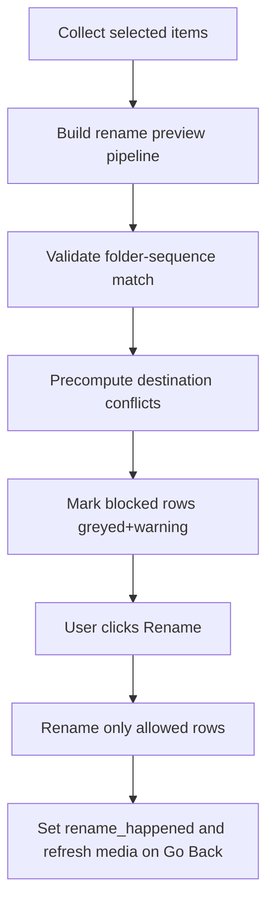

# Implementación sección Rename modular

## Objetivo confirmado
Implementar `Rename` para **todos los items seleccionados** (publish + input), con preview en vivo tipo transcode, 4 etapas secuenciales de transformación de nombre, persistencia de settings en INI dedicado, ejecución real de renombrado y refresh de tabla principal al volver.

## Reglas funcionales cerradas
- Secuencias EXR solo son operables si el nombre de carpeta y el prefijo de secuencia coinciden; si no, quedan **warning + greyed out** y no se renombran.
- Colisiones destino se detectan **antes de ejecutar**, se marcan como warning + greyed out, y se excluyen del rename (sin abortar todo).
- En secuencias EXR el rename aplica a **carpeta + secuencia** en conjunto.

## Cambios de código (modular)
- Extender UI principal en [C:/Users/leg4-pc/.nuke/Python/Startup/LGA_NKS_Edit_Panel_py/LGA_import_shots.py](C:/Users/leg4-pc/.nuke/Python/Startup/LGA_NKS_Edit_Panel_py/LGA_import_shots.py):
  - Reemplazar stub `_build_page_rename()` por tabla + controles + acciones (`Rename`, `Go Back`).
  - Reutilizar patrón de interacción de transcode: checkbox por fila, click/doble click, estado gris para filas no operables.
  - Al entrar a Rename, congelar snapshot de seleccionados y poblar preview.
  - Al `Go Back`, refrescar `PAGE_MEDIA` cuando hubo renames (igual que flag de transcode).
- Crear helper de lógica de rename en [C:/Users/leg4-pc/.nuke/Python/Startup/LGA_NKS_Edit_Panel_py/LGA_import_shots_rename.py](C:/Users/leg4-pc/.nuke/Python/Startup/LGA_NKS_Edit_Panel_py/LGA_import_shots_rename.py):
  - Normalización de entradas (archivo suelto vs secuencia).
  - Parser de secuencia EXR con variantes `name_####.exr` y `name.####.exr`.
  - Pipeline secuencial de 4 etapas:
    1) Search/Replace #1 (+ case sensitive)
    2) Search/Replace #2 (+ case sensitive)
    3) Delimitador antes de frame (`_` o `.`)
    4) Padding de frames (spinbox, default 4)
  - Cálculo de preview con segmentos coloreados (original vs renamed) por etapa.
  - Validaciones: mismatch carpeta/secuencia, conflictos de destino, filas bloqueadas.
  - Ejecutor de rename en disco con orden seguro (dos fases con nombres temporales para evitar choques cruzados).
- Crear helper de persistencia dedicado en [C:/Users/leg4-pc/.nuke/Python/Startup/LGA_NKS_Edit_Panel_py/LGA_import_shots_rename_settings.py](C:/Users/leg4-pc/.nuke/Python/Startup/LGA_NKS_Edit_Panel_py/LGA_import_shots_rename_settings.py):
  - INI independiente (mismo root `%APPDATA%/LGA/HieroTools`), archivo sugerido `ImportShotsRename.ini`.
  - Secciones para las 4 etapas (`SearchReplace1`, `SearchReplace2`, `Delimiter`, `Padding`).
  - API espejo de transcode settings: `load_*` / `save_*`.

## UI de Rename (detalle)
- Tabla superior (preview en vivo) con columnas:
  - barra color, checkbox, `Original`, `→`, `Renamed`, `Folder`, `Estado`.
- Representación de secuencias:
  - Mostrar una sola entrada por secuencia con placeholder de padding: `nombre_####.exr` o `nombre.####.exr` según corresponda.
  - Cantidad de `#` refleja padding real en original y padding destino en renamed.
- Colores por etapa (mismos de transcode ya existentes):
  - Etapa 1: `_CLR_AR` (amarillo)
  - Etapa 2: `_CLR_PAR` (rosa)
  - Etapa 3: `_CLR_COMP_DWAA` (verde)
  - Etapa 4: `_CLR_STATUS_PENDING` (cyan)
- Controles inferiores en orden secuencial:
  - Search/Replace #1 (+ case sensitive)
  - Search/Replace #2 (+ case sensitive)
  - Delimiter selector (`_` o `.`)
  - Frame digits (`_ArrowSpinBox`, default 4, mismo estilo de transcode)
- Fila bloqueada/greyed en:
  - mismatch carpeta-secuencia original
  - conflicto de destino precomputado
  - cualquier invalidación de preview

## Flujo de validación y ejecución

## Documentación
- Crear MD dedicado de Rename en [C:/Users/leg4-pc/.nuke/Python/Startup/LGA_NKS_Edit_Panel_py/LGA_import_shots_rename.md](C:/Users/leg4-pc/.nuke/Python/Startup/LGA_NKS_Edit_Panel_py/LGA_import_shots_rename.md) con:
  - reglas funcionales, estructura de tabla, pipeline de etapas, persistencia INI, edge-cases.
- Actualizar [C:/Users/leg4-pc/.nuke/Python/Startup/LGA_NKS_Edit_Panel_py/LGA_import_shots.md](C:/Users/leg4-pc/.nuke/Python/Startup/LGA_NKS_Edit_Panel_py/LGA_import_shots.md):
  - reemplazar estado “stub” de Rename por referencia al nuevo MD y resumen corto.
  - mantener este MD como overview y no duplicar detalle largo.

## Verificación propuesta
- Casos de preview:
  - secuencia con `_` y con `.` antes del frame
  - padding mayor/menor al destino (ej. `#######` -> `####`)
  - cadenas afectadas por etapa 1 y luego etapa 2 (secuencial real)
- Casos bloqueados:
  - carpeta vs secuencia no coinciden
  - destino ya existe o colisiona con otro rename del batch
- Flujo UX:
  - doble click abre ubicación y no rompe estado de checkbox
  - `Go Back` refresca media con nombres nuevos
  - settings persisten tras cerrar/reabrir diálogo